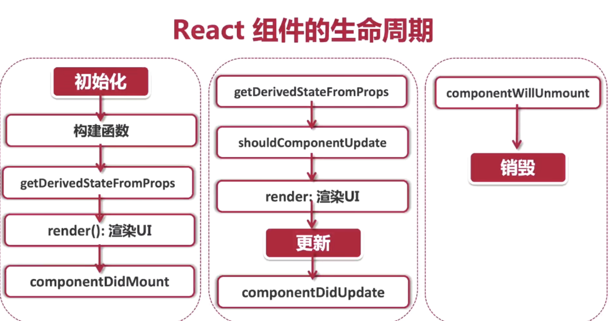

### 为什么使用JSX
- React 并不强制使用JSX，也可以使用原生JavaScript
- React 认为视图的本质就是渲染逻辑与UI视图表现的内在统一
- React 把HTML与渲染逻辑进行了耦合，形成了JSX

### JSX的特点
- JSX的特点:常规的HTML代码都可以与JSX兼容
- JSX的命名约定:小驼峰
- JSX会被编译为React.createElement()对象

### 如何在JSX中防止XSS注入攻击(跨站脚本)
- 使用花括号直接引用渲染内容的时候，React会自动转义(将html转化为字符串)
- 参考技术 js王者归来

### CSS module (模块化)
- 每个jsx或者tsx文件就被视为一个独立存在的原件
- 原件所包含的所有内容也同样都应该是独立存在的

### TS的定义声明
- *.d.ts
- 只包含类型声明，不包含逻辑
- 不会被编译、也不会被webpack打包

### css引入
- 直接引入整个CSS文件
- JSS模块化引入组件
- 第三方插件 npm install typescript-plugin-css-modules --save-dev

### State与Props的区别
- props是组件对外的接口，而state是组件对内的接口
- props用于组件间数据传递，而state用于组件内部的数据传递

### State正确的打开放
- state是私有的，可以认为state是组件的私有属性
- 用setState()修改State
- 初始化:构建函数constructor是唯一可以初始化的地方
- 调用setState后，state不会立刻改变，是异步操作
- 不要依赖当前的State，计算下个State

### Props
- 本质上，props就是传入函数的参数，是从传入组建内部的数据。更准确地说，是从父组件传递给子组件的数据
- Immutable
   1. 中文：不变的
   2. 对象一旦创建就不可改变，只能通过销毁、重建来改变数据
   3. 通过判断内存地址的是否一致，来确认对象是否有经过修改
- props是只读属性
- 函数式编程

### 事件处理
```js
 handclick = (e) => {
    console.log("e.target", e.target);//target 描述的是事件发生的元素
    console.log("e.currentTarget",e.currentTarget);//currentTarget 描述事件绑定的元素
    this.setState({isOpen:!this.state.isOpen})
  }
```
### 异步处理数据
- 原生
  1. AJAX 
  2. callback
  3. 程序栈stack，先进先出
- Promise
- 对any的理解
  1. 资源来源于网络请求，返回的数据类型不受控制
  2. 前端强行定义API数据类型，违反前端后端分离的原则
  3. 不能为使用Type而放弃Js的灵活性
- https://github.com/typicode/json-server 服务器
- setState 是异步更新，同步执行

### React组件的生命周期
- Mounting:创建虚拟DOM，渲染UI
- Updating:更新虚拟DOM，重新渲染UI
- Unmounting:删除虚拟DOM，移除UI

### React 组件的生命周期(类组件)
- 初始化
- 更新
- 销毁


### React 版本变化
- 虽然没有新功能，但具有战略意义
- 替换了底层的代码，向下兼容、同时甩掉了历史包袱
- 没有代码断层，给未来留下了足够的升级空间
1. 逐步升级
- 逐步升级，允许多个react版本共存
- 先升级路由系统、再升级弹窗，平滑的过度到最新的版本
2. Breaking Changes
- 事件委托机制的改变
- 向原生浏览器靠拢
- 删除事件池
- useEffect清理操作改为异步操作
- JSX不可返回undefined
- 删除部分私有API
### 纯函数(pure function)
- 给一个函数同样的参数，那么这个函数永远返回同样的
- 函数式编程理念
- React组件输入同样的参数(props),渲染UI应该永远一样
- 副作用与纯函数相反，指一个函数处理了与返回值无关的事情
### useEffect
- 在useEffect函数中去掉第二个参数，会无限call
- 为了避免这种循环，在第二个参数加上一个空数组
```js
  useEffect(() => {
    fetch('https://jsonplaceholder.typicode.com/users')
      .then((response) => response.json())
      .then(data => setRobotGallery(data))
  }, [])
```
- 结合async、await
```js
useEffect(() => {
    const fetchData = async () => {
      const response = await fetch('https://jsonplaceholder.typicode.com/users');
      const data = await response.json()
      setRobotGallery(data)
    };
    fetchData();
  }, [])
```
### 高阶组件 
- 高阶组件(HOC) 就是一个返回了组件的函数
- 通过组件嵌套的方法给子组件添加更多的功能
- 接收一个组件作为参数并返回一个经过改造的新组件

### 为什么要使用高阶组件
- 抽取重复代码，实现组件复用
- 条件渲染，控制组件的渲染逻辑(渲染劫持)
- 捕获/劫持被处理组件的生命周期

### 正确的项目启动思路
- 总结业务 -> 建立业务模型 -> 确定业务流程 -> 确定页面关系与数量