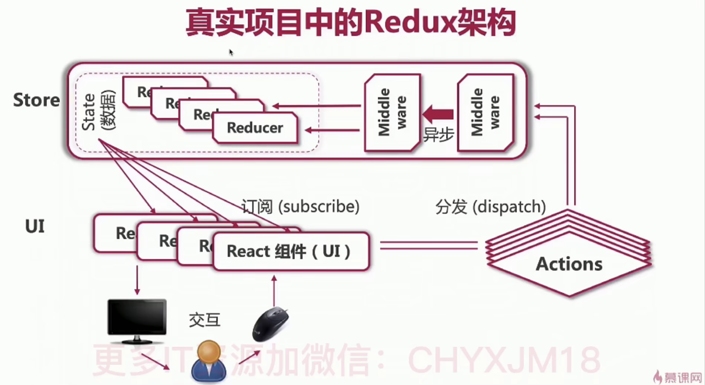

### 路由是什么？
- 当浏览器的url产生变化时，浏览器页面相应的发生改变
### SPA是什么？
     UI <=> 前端服务 <=> SPA
浏览器
     数据 <=> 后端API <=> 数据库
- JS、CSS、HTML打包为一个超级大的文件，一次性丢给浏览器
- JS劫持浏览器路由，生成虚拟路由来动态渲染页面dom元素
- 符合前后端分离的趋势，服务器不负责UI输出，而专注于数据支持
- 同时支持桌面App、手机App、网站App
  
- React 网站使用的路由系统都是虚拟的
- 与后端服务器没有半毛钱关系，与实际文件也没有一一对应的关系
- 主页，http://localhost:3000
- 搜索页面,http://localhost:3000/search
- 旅游路线详细页面,localhost:3000/touristRoutes/{id}

### React 路由框架
- 综合性路由框架:react-route
- 浏览器路由框架:react-keeper
- 手机app框架(react-native):react-navigation

### 配置路由
yarn add react-router-dom
- react-router-dom 用于浏览器，处理Web App的路由
- react-router-native 用于React Native，处理手机app的路由
- react-router-redux 提供了路由中间件，处理redux的集成
- react-router-config 用来静态配置路由

react-router-dom
- 会自动安装react-router核心框架
- <Link/> 组件可以渲染出 <a/>标签
- <BrowserRouter /> 组件利用H5 API实现路由切换
- <HashRouter /> 组件利用原生的JS中的windows.location.hash实现路由切换

### react-router-dom

- 共享局部路径需要加exact
```js
// 模糊识别第一个 /
<BrowserRouter>
  <Route path="/" component={HomePage} />
  <Route path="/signIn" render={()=><h1>登陆页面</h1>}/>
</BrowserRouter>

// 精确识别
<BrowserRouter>
  <Route exact path="/" component={HomePage} />
  <Route exact path="/signIn" render={()=><h1>登陆页面</h1>}/>
</BrowserRouter>

// 跟路径优先级更高
<BrowserRouter>
  <Switch>
    <Route exact path="/" component={HomePage} />
    <Route path="/signIn" render={()=><h1>登陆页面</h1>}/>  
  </Switch>
</BrowserRouter>
```

### 网站路由系统的要求
- 路由导航与原生浏览器操作行为一致
  <BrowserRouter>
- 路由的路径解析原理与原生浏览器一致，可以自动识别url路径
  <Route>
- 路径的切换以页面为单位，不要页面堆叠
  <Switch>

###  <Link/> 原理
```js
interface LinkProps {
  to: string;
}
const Link:React.FC<LinkProps> = ({childreb,ti}) => {
  const history = useHistory()
  return (
    <a href={to} onClick={() => {history.push(to)}}>
    </a>
  )
}
```

### react 实际上只是UI框架
- 通过JSX生成动态dom渲染UI
- 没有架构、没有模版、没有设计模式、没有路由、也没有数据管理
- 设计模式与数据管理缺一不可

### 设计模式 Redux
- 剥离组件数据(store)
- 数据统一存放在store中
- 组件订阅store获得数据 
- 什么时候需要使用Redux
  1. 组件需要共享数据的时候
  2. 某个状态需要在任何地方都可以被随时访问的时候
  3. 某个组件需要改变另一个组件的状态的时候
  4. 语言切换、暗黑模式切换、用户登陆全局数据共享

### 真是项目中的Redux架构
